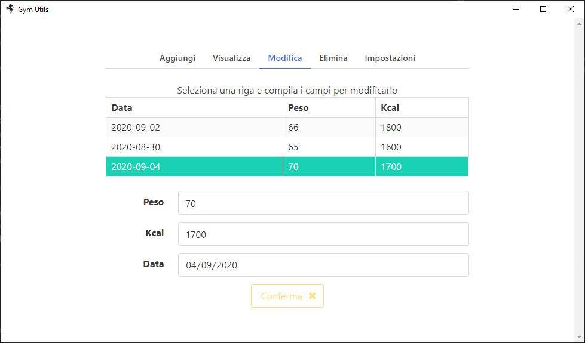
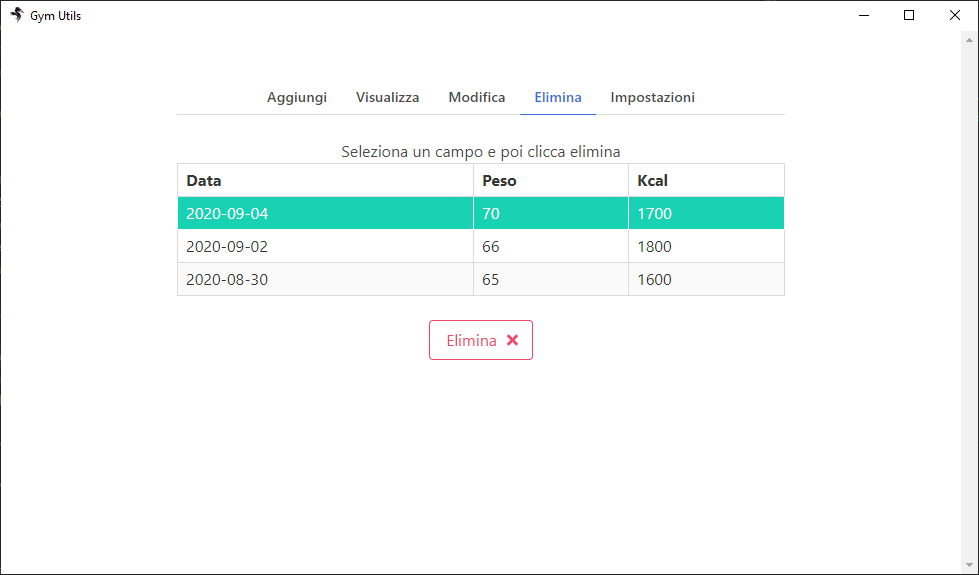

# GymUtility

GymUtility is a tool to track your gym progress!
At the moment it is possibile to track:
*  daily weight  
*  daily consumed Kcal 

#Installation
At the moment the app is only supported on windows and you can either download the .exe provided in the latest release 
or generate the .exe yourself in the following way:
* Download the source code
* execute **"npm install"**
* execute **"npm make"**
The .exe will be in the /out folder

#Usage
The app is divided in 5 Parts and the UI for each of them is pretty straight forward.

# Add (Aggiungi) 

  

Here you can add you daily weight and your kcal.

# View (Visualizza)
 

  

Here you are able to see the datas you have inserted through a table and a chart.
Also, on the bottom part of the page there are some other useful infos like max weight, min weight, etc..

# Edit (Modifica)
 

  

In this tab you can edit the value of previously added records

# Delete (Elimina)
 

  

In the Delete tab you cad delete a previously recorder value

# Settings (Impostazioni)

  

This tab is still under construction and at the moment, the only option is to **delete every record*
 
